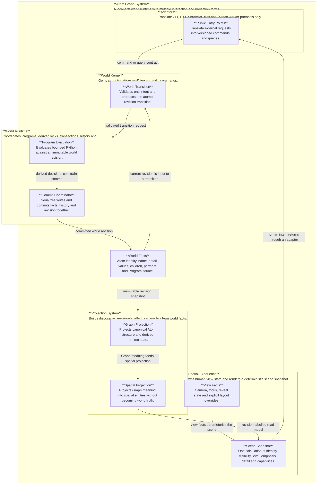

# Atom Graph Whole-System Target Architecture

## Decision

Build a modular monolith with one world kernel and explicit capability boundaries. Do not split the product into network services. The current implementation remains a behavior, data-compatibility and rollback oracle; it does not define the target module structure.

## System ontology



## Fact ownership

| Fact | Sole owner | Durable form | Other forms |
|---|---|---|---|
| Atom semantics and Program source | World Kernel | `atom.json` through repository port | Graph and Spatial projections |
| World revision and committed transition | World Runtime | transaction history plus world revision | receipts and logs |
| Derived locks and Program messages | World Runtime | revision-scoped runtime result when needed | CLI/Web receipt projection |
| Graph read model | Projection System | `graph.json`, replaceable | memory snapshot |
| Spatial read model | Projection System | `knowledge.json`, replaceable | browser scene input |
| Camera, focus, reveal and layout override | Spatial Experience | versioned view-state repository | scene snapshot |
| Backup copies | Operations | verified immutable backup | never authoritative |

`knowledge.json` must not remain a mixed owner of projected world meaning and human view facts. Migration separates view facts before declaring the Spatial projection disposable.

## Contract matrix

| Producer | Consumer | Contract | Success | Failure invariant |
|---|---|---|---|---|
| CLI/HTTP/Web adapter | World Kernel | `WorldCommandEnvelope v1` | accepted command id | invalid input changes nothing |
| World Kernel | World Runtime | validated transition intent | immutable transition plan | rejected intent has no side effects |
| Program evaluator | Commit coordinator | revision-bound decisions | locks/messages/transforms validated | timeout or invalid result fails closed |
| Commit coordinator | World repository | expected revision plus next facts | atomic revision advance | no partial fact/history commit |
| World repository | Projection System | immutable revision snapshot | labelled Graph/Spatial projections | stale projection is never reported current |
| Spatial Experience | Presentation | `SceneSnapshot v1` | deterministic render input | renderer never recomputes domain meaning |

## Runtime laws

1. Every external interaction receives a correlation id and observes one starting world revision.
2. Queries read an immutable revision. Commands declare the expected revision.
3. One world has one serialized commit coordinator. Concurrent stale commands fail explicitly or are retried by policy.
4. Program work is bounded by time, concurrency and revision. Internal calls do not recursively start an interaction.
5. A successful commit advances world facts and durable history atomically, then invalidates projections.
6. Projection rebuild may be asynchronous, but every projection carries its source world revision.
7. Startup verifies configuration, world facts and recoverability before accepting commands.
8. Unknown runtime corruption stops writes; operational input errors do not crash the service.

## Target source structure

```text
src/atom-system/
  world-kernel/       canonical model, queries, command validation, transition plans
  world-runtime/      transaction coordinator, Program port, locks, history, recovery
  projections/        Graph and Spatial pure projection contracts
  spatial-experience/ view facts, interaction intents and deterministic scene snapshots
  adapters/           CLI, HTTP, browser, JSON repository and Python worker adapters
  operations/         configuration, logging, backup, migration and health
  public/             the only supported imports for product entry points
```

Dependencies point toward contracts and pure domain code. `world-kernel` imports no adapter, DOM, HTTP, filesystem or worker module. Presentation consumes `SceneSnapshot`; it does not inspect world storage.

## Migration and rollback

1. Add executable contracts and target directories without routing production traffic.
2. Implement the World public facade and validate it against the current engine with shared fixtures.
3. Move authoritative command/query behavior behind the facade; adapters stop importing engine internals.
4. Establish revision-labelled pure projections and compare old/new outputs before switching readers.
5. Separate durable view facts from the replaceable Spatial projection with a verified migration copy.
6. Move scene semantics behind `SceneSnapshot`, then switch presentation as one coherent boundary.
7. Remove compatibility adapters only after all acceptance evidence is complete.

Each stage is a separate commit. Rollback switches the entry point to the previous facade and restores the verified pre-stage runtime snapshot. Formal data migration never overwrites the only copy and must prove counts plus hashes before cutover.

The production persistence adapter now exposes an audited rollback operation. It accepts the command id being reversed and the current expected revision, restores the exact `before` facts as a new commit, appends a second receipt, and rebuilds `graph.json`. It refuses rollback after the world has diverged. `atom.transactions.json` is therefore transaction history, not a second fact source.

## Acceptance matrix

| Requirement | Authoritative evidence |
|---|---|
| Existing behavior retained | 2026-08-11 full suite: 665 tests passed, 0 failed, 0 skipped; shared CLI, Program, lock, graph, spatial and legacy fixture contracts are included |
| Boundaries enforced | `atom-system-boundaries.test.mjs` audits every target import and rejects outward domain dependencies; public entries route through World Service |
| Single fact owner | real CLI/4784 writes use one transactional persistence port; `atom.json` remains authoritative and Graph/Spatial are reconstructible projections |
| Atomic concurrency | transaction and 4784 service tests prove serialized commits, stale-revision rejection, no lost updates and projection consistency |
| Recoverability | failure injection covers interruption before and after world write; restart recovery finalizes exactly once; rollback rehearsal restores facts and rebuilds Graph as a new audited commit |
| Projection correctness | projection tests prove deterministic rebuild, source-revision labels, stale rejection and failed-publication recovery |
| Program containment | Program port enforces 60-second deadline, cancellation, bounded concurrency, revision binding and isolated Python capabilities |
| Spatial consistency | one entity index and SceneSnapshot own identity, hierarchy, detail emphasis and read/write capability; A/S/D/F and branch expansion/collapse enter through one interaction reducer |
| Responsive interaction | declared architecture workload is 10,000 entities with 2,000 visible; index budget is 1,000 ms, interaction snapshot budget 500 ms and heap-growth budget 128 MiB; performance gate passes |
| Browser acceptance | isolated 4874 fixture loaded the production page at 1280×720, loaded `atom-spatial-scene.bundle.js`, rendered one Canvas and produced no warning/error logs |
| Data safety | view-state dry-run/reverse/conflict tests use copied fixtures; formal-world preflight was read-only and recorded 138 Atoms plus SHA-256 hashes; no formal migration was executed |
| Architecture rollback | every migration stage is an independent commit; stable worktree and pre-architecture backup remain available; formal data format is unchanged |

## Declared operating envelope

The first explicit capacity baseline is 10,000 scene entities and 2,000 simultaneously visible entities. This is an interaction-snapshot budget, not a claim that every Canvas frame redraws all 10,000 entities. Program evaluation retains its 60-second hard ceiling and bounded worker concurrency. Larger production evidence must extend this table before adding caches, worker partitions or network services.

The formal world remains outside the migration transaction until explicit cutover authority is given. Its read-only preflight on 2026-08-11 found 7 top-level and 138 total Atoms. The `atom.json` SHA-256 at preflight was `3D611C565831A1617B0E500A42C078970AFB24FDB5F25C4BAE1BB54011A3D723`. This value is evidence of non-mutation during architecture development, not a permanent expected hash.

## Remaining evolution boundary

Canvas geometry, camera projection, collision layout and hit testing remain presentation responsibilities. They may be decomposed further for maintainability, but they cannot redefine Atom identity, hierarchy, permissions or branch state. Formal view-state separation is implemented and reversible; applying it to the primary world is deliberately not part of this code-only architecture cutover.
