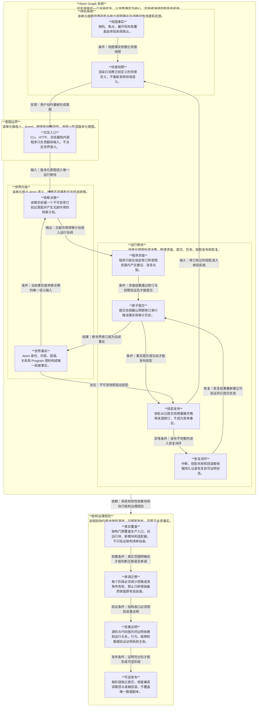

# Atom Graph 有机运行结构治理

## 决策

采用“模块化单体、单一运行脊柱、渐进绞杀旧入口”。系统不重写、不拆成网络服务，也不以拆文件或修复缺陷数量衡量进展。结构完成的标准是：所有生产交互都服从同一组运行法律，违规路径会被自动门禁拒绝，失败后能够恢复或准确回滚。

备选方案及否决理由：

- 继续在旧引擎上局部加固：交付快，但会继续保留多个事实中心和可选事务边界。
- 一次性重写：目标纯净，但行为兼容、数据安全和回滚风险不可接受。
- 渐进收口：短期保留兼容适配器，但每一步都减少一个结构自由度并增加一条自动证明；选用此方案。

## 系统本体

## 系统法律

1. 一个世界事实只有一个权威所有者；日志、缓存、Graph 和 Spatial 都不可反向成为事实。
2. 一个外部或内部意图只能进入一个运行脊柱；生产写入不存在可选事务模式。
3. 查询读取不可变修订且默认无副作用；修复投影、迁移和备份属于显式运维命令。
4. Program 是受限求值器，不是第二个命令总线；其输出必须绑定修订、资源预算和来源身份。
5. 一次成功提交同时确立事实修订和审计记录；投影可以稍后完成，但必须显式暴露滞后状态。
6. 并发命令通过预期修订排序、拒绝或按明确策略重试，不允许静默覆盖。
7. 未知损坏停止写入；已知业务拒绝不破坏服务；所有中断点都有幂等恢复语义。
8. 文件、网络、进程、时钟和随机性只通过端口进入领域与应用层。
9. 公共入口只依赖公共契约；旧实现只能位于指向内侧的兼容适配器后方。
10. 容量机制只由测量触发；当前维持模块化单体，不引入分布式一致性成本。

## 能力与事实所有权

| 能力 | 独占事实 | 对外契约 | 禁止事项 |
|---|---|---|---|
| 世界内核 | Atom 语义与合法转移 | 世界查询、转移计划 | 文件、HTTP、Worker、渲染依赖 |
| 运行脊柱 | 修订、提交顺序、历史、运行结果 | 命令、回执、恢复 | 绕过修订直接写事实 |
| 投影系统 | 可替换的修订标记读模型 | 投影快照、发布状态 | 接收用户写入或反写事实 |
| 体验系统 | 视图事实 | 场景快照、交互意图 | 推导或修改世界语义 |
| 适配器 | 无业务事实 | 协议翻译端口 | 自定义领域规则和持久化语义 |
| 运维 | 备份、迁移记录和健康证据 | 显式运维命令 | 成为在线事实源 |

## 契约矩阵

| 生产者 | 消费者 | 输入 | 输出 | 失败语义 | 版本与不变量 |
|---|---|---|---|---|---|
| 入口适配器 | 运行脊柱 | `InteractionIntent` | 接收确认或结构化拒绝 | 无状态改变 | 带版本、关联标识和身份 |
| 运行脊柱 | 世界内核 | 意图与不可变快照 | `TransitionPlan` | 纯拒绝 | 计划绑定源修订 |
| 运行脊柱 | Program 端口 | 修订快照与预算 | 有界运行结果 | 超时、取消或隔离失败 | 结果绑定程序和修订 |
| 运行脊柱 | 世界仓储 | 预期修订与下一快照 | 已提交回执 | 冲突或可恢复中断 | 比较交换、幂等命令标识 |
| 运行脊柱 | 投影系统 | 已提交世界快照 | 发布状态 | 明确 pending，不回滚事实 | 来源修订必须一致 |
| 投影与视图 | 场景系统 | 两类修订快照 | `SceneSnapshot` | 拒绝不一致组合 | 不含可写世界事实 |
| 运维入口 | 恢复与备份 | 显式运维意图 | 审计证据 | 失败保持原副本 | 可逆、哈希验证 |

## 运行模型

- 命令循环：接收意图 → 读取快照 → 领域决策 → 有界 Program 求值 → 串行提交 → 发布投影 → 返回回执。
- 查询循环：接收查询 → 选择一致性要求 → 读取指定修订的事实或投影 → 返回来源修订；不隐式写盘。
- 恢复循环：启动或显式恢复 → 检查准备记录 → 比较事实修订 → 幂等完成或停止写入 → 重建缺失投影。
- 反馈循环：场景快照 → 人或 Agent 意图 → 同一入口；展示层不得直接改变存储。
- 背压：每世界命令有界排队，Program 并发和时间有界；超限返回结构化拒绝并可观测。

## 目标结构与依赖方向

目标仍是 `src/atom-system` 中的能力模块，但门禁范围扩展到所有生产代码。允许方向为：入口/适配器 → 公共应用契约 → 运行脊柱 → 世界内核；投影依赖世界契约；体验依赖投影契约。旧 `work-engine` 只能被兼容适配器调用，不得反向导入新系统，也不得独立拥有生产写入能力。

## 迁移计划

1. 证据基线：把目标主张与当前事实分离，建立生产入口、写入、外部副作用和恢复路径清单。
2. 结构门禁：覆盖 `src`、`work-engine`、`cli` 与浏览器入口，检测逆向依赖、深层公共导入、直接事实写入和查询副作用。
3. 运行脊柱：建立统一交互契约和执行协调器；先以兼容适配器承载旧语义，保持输出一致。
4. 写入收口：生产写入缺少事务端口时失败；移除旧引擎直接持久化自由度。
5. 查询与投影分离：查询纯读；投影发布、修复和迁移成为显式能力。
6. Program 收口：Program 求值通过运行端口进入同一命令生命周期，统一预算、身份和修订。
7. 体验闭环：场景只消费版本化投影与视图事实，所有写意图回到统一入口。
8. 兼容层退役：Graph 与测试证明无生产调用后再移除旧入口。

每一阶段必须是独立提交；若行为、数据、恢复或性能证据失败，回退该阶段提交并继续使用上一入口。数据迁移先复制、比较数量和哈希，再切换读取，不覆盖唯一副本。

## 验收矩阵

| 系统主张 | 完成证据 |
|---|---|
| 有机性 | 每项事实有唯一真实写入路径；新增意图能明确归属于一个能力和一个入口 |
| 顺畅性 | CLI、HTTP、浏览器和 Program 的生产命令都能追踪为同一种端到端生命周期 |
| 健壮性 | 并发冲突、各中断点、投影失败、Program 超时和启动恢复均有故障注入证明 |
| 系统性 | 结构门禁扫描全部生产范围，并通过故意违规的反例测试证明能够拦截 |
| 数据安全 | 兼容性夹具、修订、数量和哈希一致；回滚演练恢复准确事实与投影 |
| 可观测性 | 一个关联标识贯穿意图、Program、提交、投影、回执和错误 |
| 容量 | 在声明实体规模、可见规模、Program 并发和交互预算下通过测量门禁 |
| 演进性 | 旧路径数量和兼容例外随阶段单调下降，不允许新增未登记例外 |

## 当前证据边界

当前已证明全量测试通过、GitNexus 索引新鲜且未检测到模块循环；这些证据不证明整体结构已经完成。现有依赖门禁只覆盖 `src/atom-system`，架构清单测试主要验证声明自身，真实运行仍跨越新系统与旧引擎。因此本文从此刻起作为治理目标，所有“已完成”状态必须由验收矩阵中的对应证据更新，不能由文档描述或测试总数替代。

## 阶段证据：4784 运行脊柱

截至 2026-08-12，本阶段只确认以下已经由当前证据证明的范围：

- 仓库级结构门禁覆盖 `src`、`work-engine` 与 `cli`，并用真实违规夹具证明能够拦截未登记入口、旧引擎绕行和直接事实写入。
- 4784 的初始化、命令、Program、反馈、人类状态更新、Graph 发布和 Spatial 发布进入同一交互运行生命周期。
- `atom` 查询不再隐式创建或改写 Graph 投影；投影发布与恢复由运行生命周期显式执行。
- 只读查询语义已成为独立能力；命令引擎与 Program 调度共同依赖同一查询、坐标和访问控制实现，Program 不再反向依赖旧命令引擎。
- 命令引擎不再拥有直接事实写入实现；任何世界变更缺少显式提交端口时都会被拒绝，生产与测试均通过事务适配器提交。
- CLI 不再内置本地执行默认值；公开入口注入 4784 HTTP，维护入口注入同一交互运行时，旧公共 barrel 不再暴露命令引擎。
- 全量回归为 690 项：682 通过、8 跳过、0 失败；架构门禁 8 项全部通过，临时结构债务账本已清零。
- GitNexus 相对安全备份提交 `3ad1039` 识别 19 个文件、88 个符号、11 条受影响流程，风险为 high；索引未发现循环依赖。

系统验收门现已固化为 `npm run test:system`。当前 45 项系统契约全部通过，覆盖：同修订并发命令只允许一个提交、命令幂等；提交前与写入后中断的启动恢复；已提交事实的投影补偿且不重放命令；Program 并发上限、取消、超时、失败隔离和超时后继续服务；10,000 实体、2,000 可见实体的交互预算；按提交前快照精确回滚，以及世界已经继续演进时拒绝危险回滚。

因此，4784 运行脊柱阶段的结构、并发、恢复、容量和精确回滚证据已经闭合。这里的“完成”仅指该运行结构基线已经可执行、可门禁、可回归；它不表示未来功能没有缺陷，也不表示当前容量预算可以无测量地外推到更大规模。后续复杂功能必须先归入既有能力边界，再通过 `test:architecture`、`test:system` 与全量回归，不能另建旁路。
