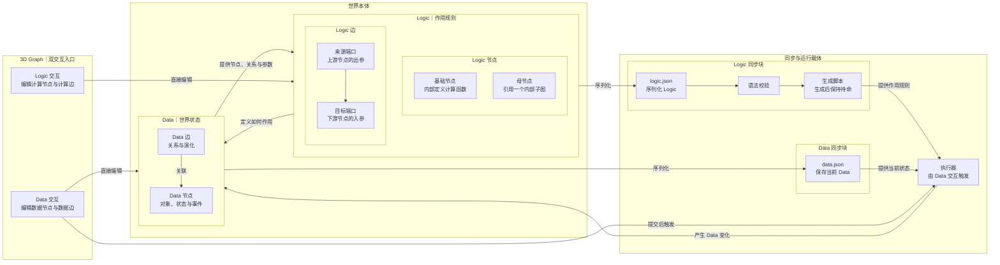

# World Modeling：Logic–Data 交互与执行框架

> 状态：初步框架备份。用于固定当前已经确认的本体关系与执行边界，不代表具体语法、数据库或运行实现已经定案。

## 核心框架



## 已确认边界

1. **世界本体只有 Logic 与 Data。**
   - Logic 包含计算节点与计算边，负责定义作用规则。
   - Data 包含数据节点与数据边，负责承载世界状态。
   - Logic 与 Data 相互作用，但节点和边保留各自不同的语法与职责。

2. **3D Graph 直接编辑世界本体。**
   - Logic 交互直接创建、修改或连接 Logic 节点与边。
   - Data 交互直接创建、修改或连接 Data 节点与边。
   - JSON 不是世界本体，只是本体结构的序列化载体。

3. **Logic 编辑只生成脚本，不执行脚本。**

   ```text
   Logic 交互
   → 修改 Logic 本体
   → logic.json
   → 语法校验
   → 生成脚本
   → 脚本待命
   ```

4. **Data 编辑才触发执行。**

   ```text
   Data 交互
   → 修改 Data 本体
   → data.json
   → 触发执行器
   → 执行器加载待命脚本并加工 Data
   → 回写新的 Data 状态
   ```

5. **脚本文件与执行器不是一回事。**
   - 脚本文件保存计算规则，本身不会主动运行。
   - 执行器负责加载脚本、读取 Data、调用函数并回写结果。

6. **执行触发必须避免自激循环。**
   - 用户或外部提交的 Data 交互可以触发执行。
   - 执行器回写的 Data 变化默认不得再次自动触发同一次执行链。

## Logic 最小语义

借鉴可视化工作流产品的基础思路，但不引入完整工作流体系：

- 基础节点拥有明确入参与出参，内部定义一个计算函数。
- Logic 边把上游节点的具名出参连接到下游节点的具名入参。
- 一条 Logic 边同时表达参数传递与执行依赖。
- 母节点对外仍表现为普通节点，对内通过引用指向一个子图。
- 子图只定义一次，可以被多个母节点引用；首个版本不允许母节点递归引用自身。

## 暂缓问题

- `data.json` 是否进一步转换为文档数据库、图数据库或其他存储形式。
- Logic 节点、Logic 边和母节点引用的完整 JSON 语法。
- Graph 生成脚本时采用 JavaScript、Python 或其他目标语言。
- 从传统脚本反向恢复 Graph 的能力；首个版本只考虑 Graph 到脚本的单向生成。
- 分支、循环、并发、失败恢复和外部副作用治理。

## 当前最小主线

```text
3D Graph 直接编辑 Logic / Data
        ↓
Logic 序列化并生成待命脚本
        ↓
Data 交互触发执行器
        ↓
执行器使用脚本加工 Data
        ↓
新 Data 回到世界本体
```
